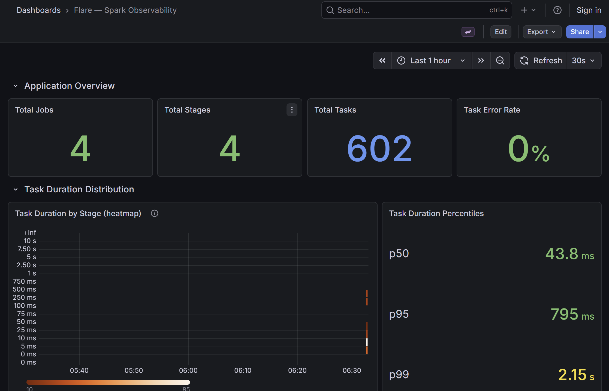
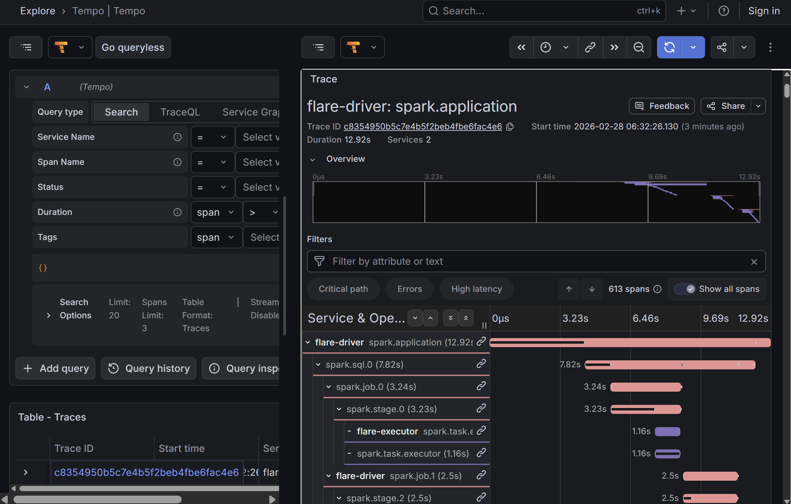
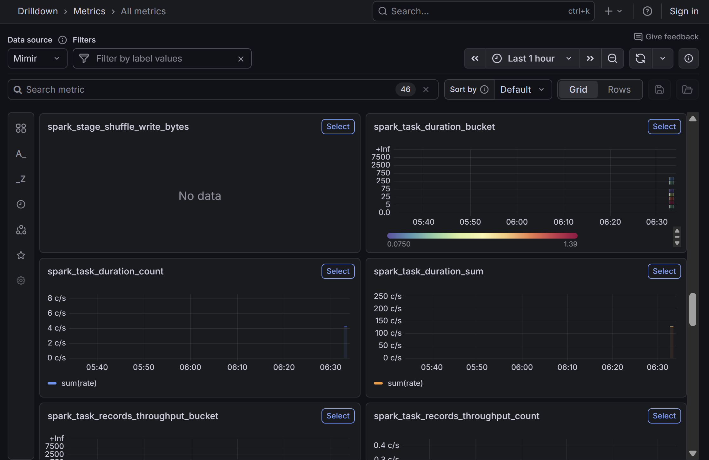
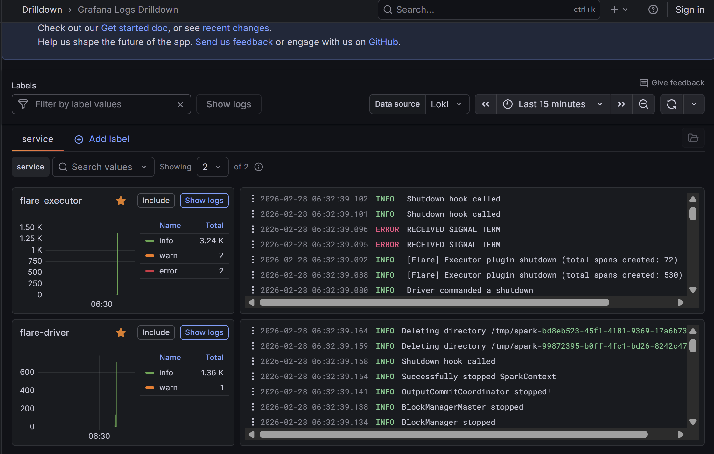

# Flare

Full-stack OpenTelemetry observability for Apache Spark — traces, metrics, and logs correlated across driver and executor JVMs.



```
spark.application                          (flare-driver)
├── spark.sql.0                            (flare-driver)
│   ├── spark.job.0                        (flare-driver)
│   │   └── spark.stage.0                  (flare-driver)
│   │       ├── spark.task.executor        (flare-executor)
│   │       └── spark.task.executor        (flare-executor)
│   └── spark.job.1                        (flare-driver)
│       └── spark.stage.2                  (flare-driver)
│           ├── spark.task.executor        (flare-executor)
│           └── spark.task.executor        (flare-executor)
└── spark.sql.1                            (flare-driver)
    └── spark.job.2                        (flare-driver)
        └── spark.stage.4                  (flare-driver)
            ├── spark.task.executor        (flare-executor)
            └── spark.task.executor        (flare-executor)
```

## Overview

Most Spark observability stops at the driver. You get a stage span with an aggregate duration but cannot see which executor ran slow, which partition was skewed, or whether a retry happened on a specific node.

Flare hooks `DAGScheduler.submitMissingTasks` via ByteBuddy to inject a per-stage W3C `traceparent` into task properties before tasks are created. On the executor, the traceparent is extracted and restored as OTEL context, creating task spans with accurate wall-clock timing nested under their specific stage span. The full hierarchy — `app → sql → job → stage → task` — spans two JVM services with zero orphan spans.

## Features

**Traces**
- **Full span hierarchy** — `app → sql → job → stage → task` across driver and executor JVMs
- **Executor task spans** — real spans on the executor thread, not driver-side approximations
- **Per-stage context** — each task inherits its specific stage span as parent, including AQE sub-jobs
- **W3C trace continuity** — `traceparent` propagated via Spark's local property channel
- **Granularity control** — jobs, stages, tasks, or all; plus slow-task and retry-only filters
- **Sampling** — consistent across the JVM boundary via W3C traceparent flags



**Metrics**
- **Task duration histograms** — with exemplar links back to the originating trace
- **Shuffle I/O counters** — read/write bytes per task and per stage
- **Stage aggregates** — executor run time, input/output bytes, shuffle totals
- **Records throughput** — histogram of records processed per second



**Logs**
- **Trace-correlated logs** — driver and executor logs linked to spans via OTLP
- **MDC enrichment** — trace ID and span ID injected into log context during task execution



**General**
- **Zero code changes** — two JARs, two `--conf` lines on `spark-submit`
- **OTEL native** — OTLP export to any backend (Grafana, Jaeger, Honeycomb, Datadog)
- **Provisioned Grafana dashboard** — task duration heatmaps, shuffle skew detection, executor comparison, logs, and trace links out of the box

## Installation

```bash
spark-submit \
  --conf "spark.plugins=io.flare.spark.plugin.FlareSparkPlugin" \
  --conf "spark.driver.extraClassPath=/opt/flare/flare-spark.jar" \
  --conf "spark.executor.extraClassPath=/opt/flare/flare-spark.jar" \
  --conf "spark.driver.extraJavaOptions=\
    -javaagent:/opt/flare/opentelemetry-javaagent.jar \
    -Dotel.javaagent.extensions=/opt/flare/flare-spark.jar \
    -Dotel.service.name=my-app-driver \
    -Dotel.exporter.otlp.protocol=grpc \
    -Dotel.exporter.otlp.endpoint=http://your-collector:4317" \
  --conf "spark.executor.extraJavaOptions=\
    -javaagent:/opt/flare/opentelemetry-javaagent.jar \
    -Dotel.javaagent.extensions=/opt/flare/flare-spark.jar \
    -Dotel.service.name=my-app-executor \
    -Dotel.exporter.otlp.protocol=grpc \
    -Dotel.exporter.otlp.endpoint=http://your-collector:4317" \
  myapp.jar
```

Both JARs must be accessible on every node. On Kubernetes, bake them into your Spark image. On YARN/EMR, use `--files` and reference via `{{PWD}}`.

## Configuration

| Variable | Default | Description |
|----------|---------|-------------|
| `FLARE_TRACE_GRANULARITY` | `stages` | `jobs` / `stages` / `tasks` / `all` |
| `FLARE_SAMPLING_RATIO` | `0.1` | 0.0-1.0, validated at startup |
| `FLARE_SLOW_TASK_MS` | `0` (disabled) | Only emit task spans exceeding this ms |
| `FLARE_RETRY_TASKS_ONLY` | `false` | Only emit spans for retries and speculative tasks |
| `FLARE_MAX_SPANS_PER_TRACE` | `10000` | Circuit breaker for high-cardinality jobs |
| `FLARE_METRICS_ENABLED` | `true` | Enable OTEL metrics (task duration, shuffle bytes, stage aggregates) |
| `FLARE_ENABLED` | `true` | Kill switch |

Set via `-DFLARE_*` in `extraJavaOptions` or as environment variables.

## Building

Requires Java 17+ and sbt.

```bash
sbt compile
sbt assembly  # fat JAR at target/scala-2.13/flare-spark-assembly-*.jar
```

## Docker

A full observability stack is provided for local development — Spark cluster, Alloy (OTLP collector), Tempo (traces), Mimir (metrics), Loki (logs), and Grafana with a pre-built dashboard:

```bash
sbt assembly
sbt "examples/assembly"

cd docker
docker compose up -d
```

Assembly JARs are bind-mounted from the build tree — just re-run `sbt assembly` and restart the job, no Docker rebuild needed.

Run the skewed partition example:

```bash
docker compose exec spark-master \
  /opt/spark/bin/spark-submit \
  --master spark://spark-master:7077 \
  --class io.flare.examples.SkewedJob \
  /opt/flare/flare-examples.jar
```

Open Grafana at `http://localhost:3000`:
- **Dashboards > Flare — Spark Observability** — task duration heatmap, shuffle skew, executor comparison, stage summary, logs, and trace links
- **Explore > Tempo** — search traces by service name, drill into span details with linked metrics and logs
- **Explore > Mimir** — query spark_task_* and spark_stage_* metrics directly

## Architecture

```
ByteBuddy (OTEL agent extension)
├── SparkContextInstrumentation        # auto-registers listener + executor plugin
├── SubmitMissingTasksInstrumentation  # hooks DAGScheduler.submitMissingTasks
│   └── SubmitMissingTasksAdviceHelper # creates job/stage spans, injects traceparent
├── TaskRunnerInstrumentation          # hooks Executor$TaskRunner.run()
│   └── TaskRunnerAdviceHelper         # extracts traceparent, restores OTEL context
└── TracingSparkListener               # adopts pre-created spans, manages lifecycle

FlareSparkPlugin (backward compat)
├── FlareDriverPlugin                  # fallback when ByteBuddy is not active
└── FlareExecutorPlugin                # creates task spans on executor
```

Context propagation path:

```
Driver: DAGScheduler.submitMissingTasks(stage, jobId)
  → ByteBuddy advice creates stage span
  → injects traceparent into ActiveJob.properties
  → properties serialized into TaskDescription
  → sent to executor JVM
Executor: TaskRunner.run() / ExecutorPlugin.onTaskStart()
  → extracts traceparent from task properties
  → restores OTEL context → task span with executor-side timing
```

## Stack

- Scala 2.12 / 2.13, Spark 3.5 / 4.0
- OpenTelemetry Java Agent 2.16.0 (extension mechanism)
- OpenTelemetry API 1.50.0
- munit (tests)

## License

Apache License 2.0
