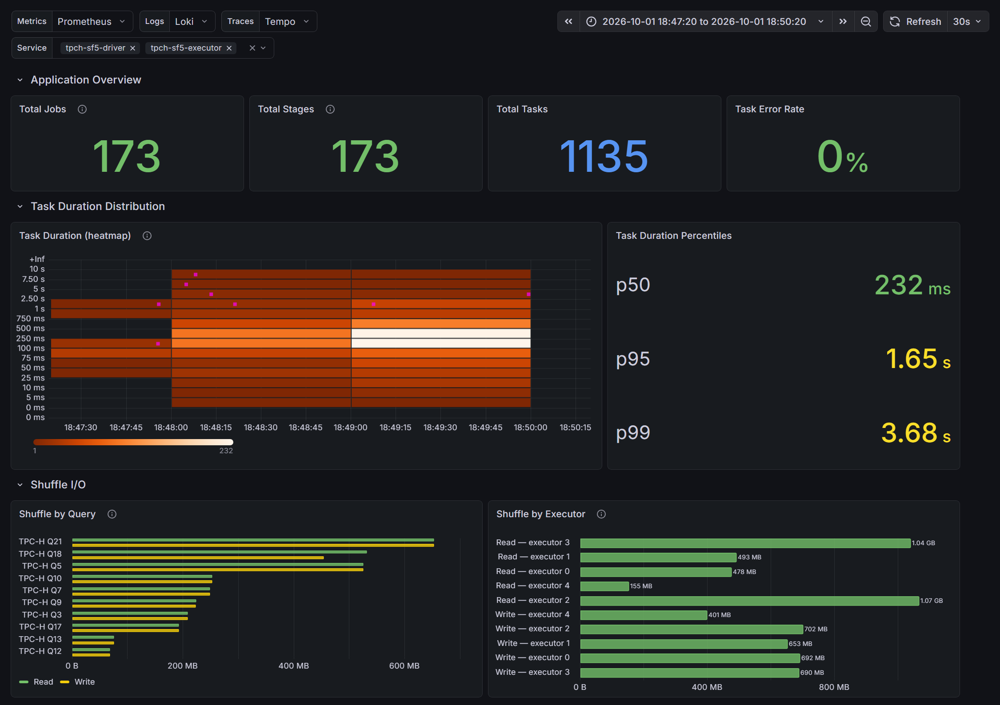
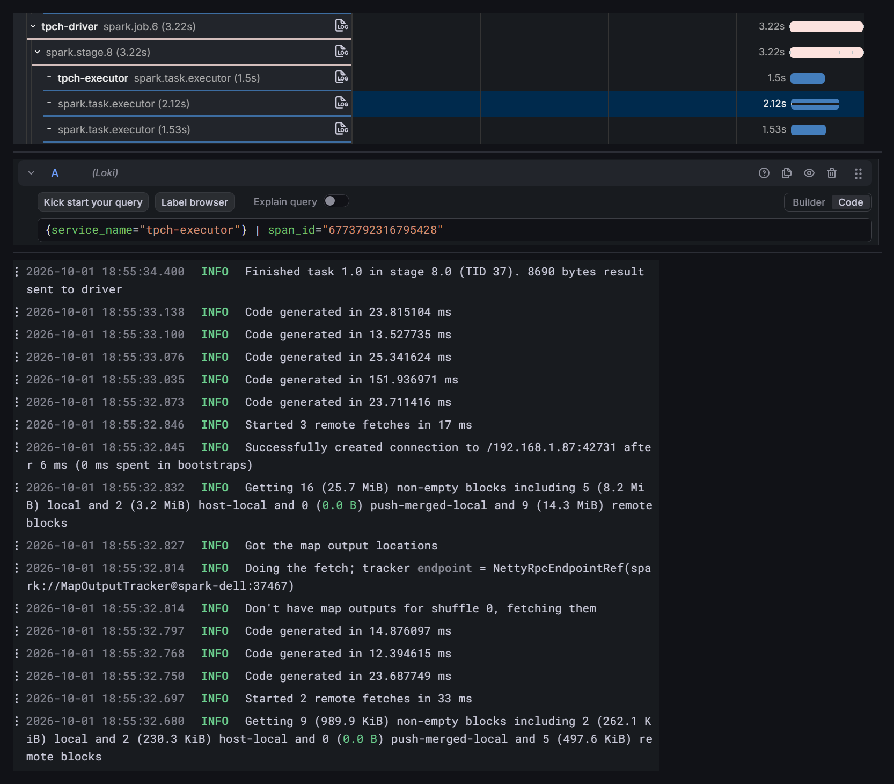

# Flare

[](https://central.sonatype.com/artifact/io.github.neutrinic/flare-spark-3-5_2.13)
[](https://github.com/Neutrinic/flare/actions/workflows/ci.yml)
[](LICENSE)

Full-stack OpenTelemetry observability for Apache Spark: traces, metrics and logs correlated across driver and executor JVMs.



```
spark.application                          (flare-driver)
├── spark.sql.0                            (flare-driver)
│   ├── spark.job.0                        (flare-driver)
│   │   └── spark.stage.0                  (flare-driver)
│   │       ├── spark.task.executor        (flare-executor)
│   │       └── spark.task.executor        (flare-executor)
│   └── spark.job.1                        (flare-driver)
│       └── spark.stage.2                  (flare-driver)
│           ├── spark.task.executor        (flare-executor)
│           └── spark.task.executor        (flare-executor)
└── spark.sql.1                            (flare-driver)
    └── spark.job.2                        (flare-driver)
        └── spark.stage.4                  (flare-driver)
            ├── spark.task.executor        (flare-executor)
            └── spark.task.executor        (flare-executor)
```

## Overview

Most Spark observability stops at the driver. You get a stage with an aggregate duration, but not
which executor ran slow, which partition was skewed, or where a retry happened.

Flare is an extension to the OpenTelemetry Java agent. On the driver it gives every stage its own
W3C `traceparent` and passes it to the tasks through Spark's task properties. On the executor it
restores that context, so each task becomes a real span, timed on the executor, under its own stage.
The full hierarchy, `application → sql → job → stage → task`, spans the driver and executor JVMs,
with metrics and logs linked to it. Everything is exported over OTLP to any backend.

## Features

- **Traces:** the full span hierarchy across driver and executor JVMs, with SQL plans, failures and
  task metrics as attributes. Granularity, slow-task and retry-only filters, and sampling by
  application.
- **Metrics:** task duration histograms with exemplar links to their traces, shuffle and stage
  totals, and cluster lifecycle metrics.
- **Logs:** driver and executor logs linked to the span that wrote them.
- **No code changes:** two JARs on every node and a few `--conf` lines. A [Grafana dashboard](https://neutrinic.github.io/flare/reference/metrics/#dashboard)
  is included, for any Prometheus-compatible backend.


One task's executor logs, found by its span id:



## Quick start

Put two JARs at the same path on every node, before the JVMs start: the
[OpenTelemetry Java agent](https://github.com/open-telemetry/opentelemetry-java-instrumentation)
2.30.0 and the Flare JAR for your Spark and Scala version from
[Maven Central](https://central.sonatype.com/search?q=io.github.neutrinic) or the
[latest release](https://github.com/Neutrinic/flare/releases/latest). Then:

```bash
spark-submit   --conf "spark.plugins=io.flare.spark.plugin.FlareSparkPlugin"   --conf "spark.driver.extraClassPath=/opt/flare/flare-spark.jar"   --conf "spark.executor.extraClassPath=/opt/flare/flare-spark.jar"   --conf "spark.driver.extraJavaOptions=-javaagent:/opt/flare/opentelemetry-javaagent.jar     -Dotel.javaagent.extensions=/opt/flare/flare-spark.jar -Dotel.service.name=my-app-driver     -Dotel.exporter.otlp.endpoint=http://your-collector:4318"   --conf "spark.executor.extraJavaOptions=-javaagent:/opt/flare/opentelemetry-javaagent.jar     -Dotel.javaagent.extensions=/opt/flare/flare-spark.jar -Dotel.service.name=my-app-executor     -Dotel.exporter.otlp.endpoint=http://your-collector:4318"   my-app.jar
```

The agent exports OTLP over HTTP to port 4318 by default; see
[Exporting](https://neutrinic.github.io/flare/configuration/exporting/) for gRPC, compression and
credentials. Every platform has a recipe: standalone, YARN, Kubernetes, EMR, EMR Serverless, Dataproc, Dataproc
Serverless and Databricks.

## Documentation

**[neutrinic.github.io/flare](https://neutrinic.github.io/flare/)**

| | |
|---|---|
| [Quick start](https://neutrinic.github.io/flare/getting-started/quick-start/) | What each setting does, and choosing a JAR |
| [Deploying](https://neutrinic.github.io/flare/deploying/) | A verified recipe for each platform |
| [Configuration](https://neutrinic.github.io/flare/configuration/) | Flare's settings, sampling, SQL plans, exporting, noise |
| [Telemetry volume](https://neutrinic.github.io/flare/configuration/volume/) | Where the volume comes from, and what is turned off by default |
| [Spans](https://neutrinic.github.io/flare/reference/spans/) and [metrics](https://neutrinic.github.io/flare/reference/metrics/) | Every span, attribute and instrument |
| [Overhead](https://neutrinic.github.io/flare/reference/overhead/) | What Flare costs, measured |
| [Upgrading](https://neutrinic.github.io/flare/upgrading/) | What changes between releases |
| [Troubleshooting](https://neutrinic.github.io/flare/troubleshooting/) | When nothing, or not enough, arrives |

## Overhead

- **Most of the cost is a fixed start-up cost:** the agent instrumenting classes as each JVM starts.
  With every task traced, JVM CPU was +15% for a two-minute Databricks application and about 1% at
  twenty minutes.
- **Once warm, Flare adds nothing measurable.** CPU inside tasks is unchanged, and query time is
  within 2%.
- **The agent's own instrumentation can cost more than Flare** when data is read from object
  storage, so Flare turns it off by default and keeps only what it and your code need.

Method, tables and raw results: [Overhead](https://neutrinic.github.io/flare/reference/overhead/) and
[`benchmarks/`](benchmarks/README.md).

## Architecture

```
ByteBuddy (OTEL agent extension)
├── SparkContextInstrumentation        # hooks SparkContext init; app span + listener
├── SubmitMissingTasksInstrumentation  # hooks DAGScheduler.submitMissingTasks
│   └── SubmitMissingTasksAdviceHelper # creates job/stage spans, injects traceparent
├── TaskRunnerInstrumentation          # hooks Executor$TaskRunner.run()
│   └── TaskRunnerAdviceHelper         # extracts traceparent, restores OTEL context
└── TracingSparkListener               # adopts pre-created spans, manages lifecycle

FlareSparkPlugin (spark.plugins)
├── FlareDriverPlugin                  # application span; registers the listener
└── FlareExecutorPlugin                # creates task spans on executor
```

Context propagation path:

```
Driver: DAGScheduler.submitMissingTasks(stage, jobId)
  → ByteBuddy advice creates stage span
  → injects traceparent into ActiveJob.properties
  → properties serialized into TaskDescription
  → sent to executor JVM
Executor: TaskRunner.run() / ExecutorPlugin.onTaskStart()
  → extracts traceparent from task properties
  → restores OTEL context → task span with executor-side timing
```

## Building

See [Building Flare](https://neutrinic.github.io/flare/building/). In short: `sbt -DsparkVersion=3.5.1 ++2.13.16 assembly`.

## License

Apache License 2.0
