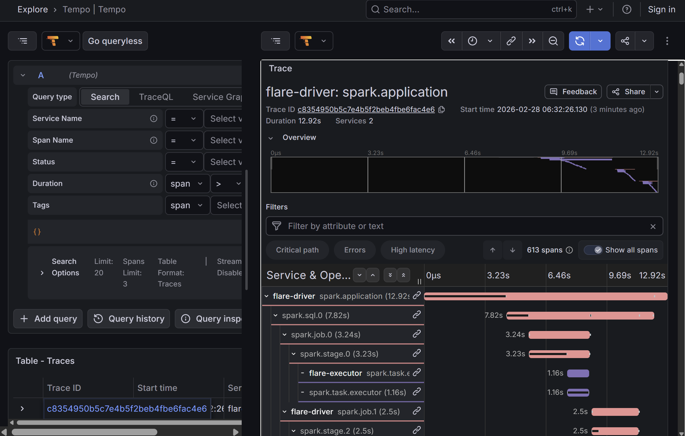

# Local stack

The repository includes a complete stack for trying Flare locally: a Spark cluster, Grafana Alloy as
the OTLP collector, Tempo for traces, Mimir for metrics, Loki for logs, and Grafana with a
provisioned dashboard.

```bash
git clone https://github.com/Neutrinic/flare.git
cd flare
sbt assembly
sbt "examples/assembly"

cd docker
docker compose up -d
```

The JARs are bind-mounted from the build tree, so after a change re-run `sbt assembly` and restart
the job. No image rebuild is needed.

Run the skewed-partition example:

```bash
docker compose exec spark-master \
  /opt/spark/bin/spark-submit \
  --master spark://spark-master:7077 \
  --class io.flare.examples.SkewedJob \
  /opt/flare/flare-examples.jar
```

Other examples in `io.flare.examples`: `PipelineJob` (three SQL executions sharing one trace),
`SimpleJob` and `FailingJob` (failure attributes).

Open Grafana at `http://localhost:3000`:

- **Dashboards → "Flare — Spark Observability":** task duration heatmap, shuffle skew, executor
  comparison, stage summary, logs and trace links.
- **Explore → Tempo:** search traces by service name and drill into span attributes, with linked
  metrics and logs.
- **Explore → Mimir:** query the `flare_task_*` and `flare_stage_*` metrics directly.


